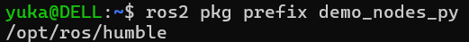
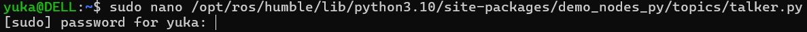
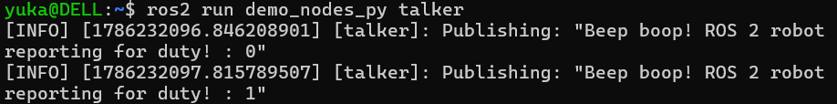
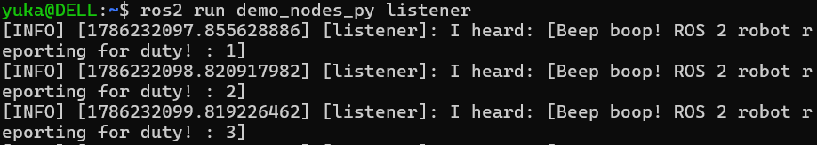

# ROS2-Tasks

## Introduction

This task was completed as an introduction to **ROS 2** and its basic communication concepts. The purpose of the task was to become familiar with how ROS 2 nodes communicate with each other using publishers, subscribers, and topics.

The work was divided into two tasks:

* **Task 1:** Create a publisher and subscriber that communicate using a message different from the default "Hello World" message.
* **Task 2:** Program a Turtle robot to move in a square pattern.

This README documents the steps followed to complete each task.

---

# Task 1: Publisher and Subscriber

## Objective

The objective of Task 1 was to run a ROS 2 **publisher and subscriber** and modify the publisher so that it sends a custom message instead of the default `"Hello World"` message.

The `demo_nodes_py` package provided by ROS 2 was used for this task. The default message in the talker was changed to:

```text
Beep boop! ROS 2 robot reporting for duty! 
```

The **talker** acts as the publisher and continuously sends the message, while the **listener** acts as the subscriber and receives the message.

## Steps

### Step 1: Find the ROS 2 Package Location

First, the location of the `demo_nodes_py` package was found using:

```bash
ros2 pkg prefix demo_nodes_py
```

This returned the ROS 2 installation location, for example:

```text
/opt/ros/humble
```



---

### Step 2: Open the Talker File

The talker Python file was opened using the following command:

```bash
sudo nano /opt/ros/humble/lib/python3.10/site-packages/demo_nodes_py/topics/talker.py
```



---

### Step 3: Modify the Published Message

Inside the `talker.py` file, the default message was:

```python
msg.data = 'Hello World: %d' % self.i
```

It was changed to a custom message:

```python
msg.data = 'Beep boop! ROS 2 robot reporting for duty!'
```


The file was then saved using:

```text
Ctrl + O → Enter → Ctrl + X
```

---

### Step 4: Run the Publisher

The ROS 2 talker was started in the first terminal using:

```bash
ros2 run demo_nodes_py talker
```

The talker acts as the **publisher**, continuously publishing the modified message.



---

### Step 5: Run the Subscriber

A second Ubuntu terminal was opened and the listener was started using:

```bash
ros2 run demo_nodes_py listener
```

The listener acts as the **subscriber** and receives the messages published by the talker.



---

## Result

The publisher successfully sent the modified message, and the subscriber successfully received it.

The listener displayed:

```text
I heard: "Beep boop! ROS 2 robot reporting for duty!"
```

This demonstrated basic communication between a ROS 2 publisher and subscriber using a topic.

---

# Task 2: Turtle Robot Movement

*Task 2 will be documented here after completing the Turtle robot movement steps.*
