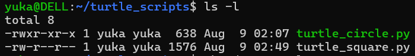
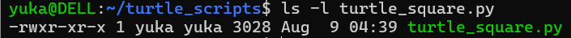
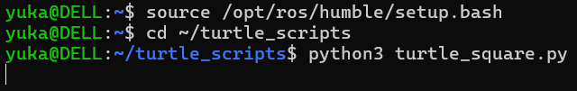
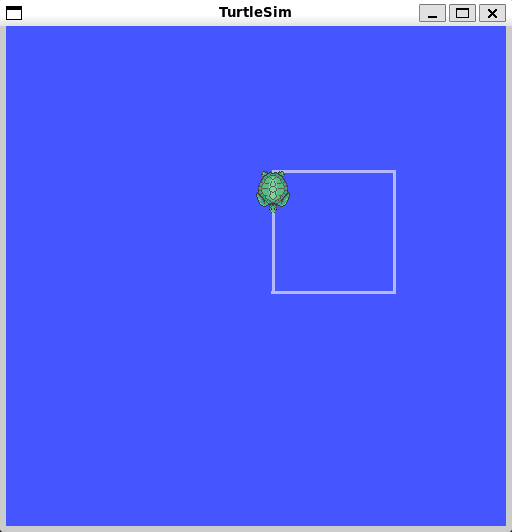

# ROS2-Tasks

## Introduction

This task was completed as an introduction to **ROS 2** and its basic communication concepts. The purpose of the task was to become familiar with how ROS 2 nodes communicate with each other using publishers, subscribers, and topics.

The work was divided into two tasks:

* **Task 1:** Create a publisher and subscriber that communicate using a message different from the default "Hello World" message.
* **Task 2:** Program a Turtle robot to move in a square pattern.

This README documents the steps followed to complete each task.

---

# Task 1: Publisher and Subscriber

## Objective

The objective of Task 1 was to run a ROS 2 **publisher and subscriber** and modify the publisher so that it sends a custom message instead of the default `"Hello World"` message.

The `demo_nodes_py` package provided by ROS 2 was used for this task. The default message in the talker was changed to:

```text
Beep boop! ROS 2 robot reporting for duty! 
```

The **talker** acts as the publisher and continuously sends the message, while the **listener** acts as the subscriber and receives the message.

## Steps

### Step 1: Find the ROS 2 Package Location

First, the location of the `demo_nodes_py` package was found using:

```bash
ros2 pkg prefix demo_nodes_py
```

This returned the ROS 2 installation location, for example:

```text
/opt/ros/humble
```


---

### Step 2: Open the Talker File

The talker Python file was opened using the following command:

```bash
sudo nano /opt/ros/humble/lib/python3.10/site-packages/demo_nodes_py/topics/talker.py
```


---

### Step 3: Modify the Published Message

Inside the `talker.py` file, the default message was:

```python
msg.data = 'Hello World: %d' % self.i
```

It was changed to a custom message:

```python
msg.data = 'Beep boop! ROS 2 robot reporting for duty!'
```


The file was then saved using:

```text
Ctrl + O → Enter → Ctrl + X
```

---

### Step 4: Run the Publisher

The ROS 2 talker was started in the first terminal using:

```bash
ros2 run demo_nodes_py talker
```

The talker acts as the **publisher**, continuously publishing the modified message.


---

### Step 5: Run the Subscriber

A second Ubuntu terminal was opened and the listener was started using:

```bash
ros2 run demo_nodes_py listener
```

The listener acts as the **subscriber** and receives the messages published by the talker.


---

## Result

The publisher successfully sent the modified message, and the subscriber successfully received it.

The listener displayed:

```text
I heard: "Beep boop! ROS 2 robot reporting for duty!"
```

---

# Task 2: Turtle Robot Movement

## Objective

The objective of Task 2 was to program a simulated Turtle robot to move in a **square pattern** using ROS 2 and the `turtlesim` simulator.

A Python ROS 2 node was created to publish velocity commands to the Turtle. The program controls the Turtle by making it move forward and rotate 90 degrees repeatedly until four sides of the square are completed.

## Steps

### Step 1: Create the Turtle Scripts Folder

A folder was created to store the Python Turtle program:

```bash
mkdir -p ~/turtle_scripts
```


---

### Step 2: Enter the Folder

The newly created folder was opened using:

```bash
cd ~/turtle_scripts
```


---

### Step 3: Create the Python Program

The Nano text editor was opened to create the Turtle program:

```bash
nano turtle_square.py
```
**see main.py for code** 


The file was saved using:

```text
Ctrl + O → Enter → Ctrl + X
```

---

### Step 4: Verify the File

The contents of the folder were checked using:

```bash
ls -l
```

The created Python file should appear:

```text
turtle_square.py
```



---

### Step 5: Give the File Execute Permission

Execute permission was given to the Python file using:

```bash
chmod +x turtle_square.py
```


---

### Step 6: Verify the File Permissions

The permissions were checked using:

```bash
ls -l turtle_square.py
```

The file should have execute permissions, shown by `x` characters in the output, for example:

```text
-rwxr-xr-x
```



---

### Step 7: Source ROS 2

The ROS 2 Humble environment was sourced using:

```bash
source /opt/ros/humble/setup.bash
```


---

### Step 8: Start the Turtlesim Simulator

The ROS 2 Turtlesim simulator was started using:

```bash
ros2 run turtlesim turtlesim_node
```

This opened the Turtlesim simulation window containing the Turtle robot.


---

### Step 9: Run the Turtle Program

In another Ubuntu terminal, ROS 2 was sourced again:

```bash
source /opt/ros/humble/setup.bash
```

Then the Turtle scripts folder was opened:

```bash
cd ~/turtle_scripts
```

Finally, the Turtle program was executed:

```bash
python3 turtle_square.py
```



---

## Task 2 Result

The Turtle successfully moved forward and turned approximately 90 degrees after completing each side. This process was repeated four times, causing the Turtle to follow a square-shaped path.



---

## License

This project is intended for educational purposes.

---

# 👩‍💻 Author

**Nassebah Al-Dubayyan**

Computer Science Student
<p align="center">
⭐ If you found this project interesting, consider giving it a star!
</p>
